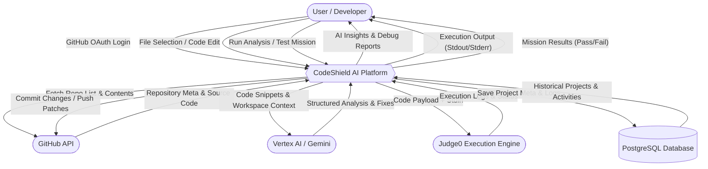

# Data Flow Diagram (DFD) - Level 0 (Context Diagram)

This diagram shows the high-level data flow between the CodeShield AI system and its external entities.

```mermaid
graph TD
    User([User / Developer])
    GitHub([GitHub API])
    AI_Service([Vertex AI / Gemini])
    Judge0([Judge0 Execution Engine])
    DB[(PostgreSQL Database)]

    %% User Interactions
    User -- "GitHub OAuth Login" --> CodeShield{{"CodeShield AI Platform"}}
    User -- "File Selection / Code Edit" --> CodeShield
    User -- "Run Analysis / Test Mission" --> CodeShield
    
    %% System Outputs to User
    CodeShield -- "AI Insights & Debug Reports" --> User
    CodeShield -- "Execution Output (Stdout/Stderr)" --> User
    CodeShield -- "Mission Results (Pass/Fail)" --> User

    %% GitHub Interactions
    CodeShield -- "Fetch Repo List & Contents" --> GitHub
    CodeShield -- "Commit Changes / Push Patches" --> GitHub
    GitHub -- "Repository Meta & Source Code" --> CodeShield

    %% AI Interactions
    CodeShield -- "Code Snippets & Workspace Context" --> AI_Service
    AI_Service -- "Structured Analysis & Fixes" --> CodeShield

    %% Code Execution
    CodeShield -- "Code Payload + Stdin" --> Judge0
    Judge0 -- "Execution Logs & Status" --> CodeShield

    %% Database Storage
    CodeShield -- "Save Project Meta & Logs" --> DB
    DB -- "Historical Projects & Activities" --> CodeShield
```
