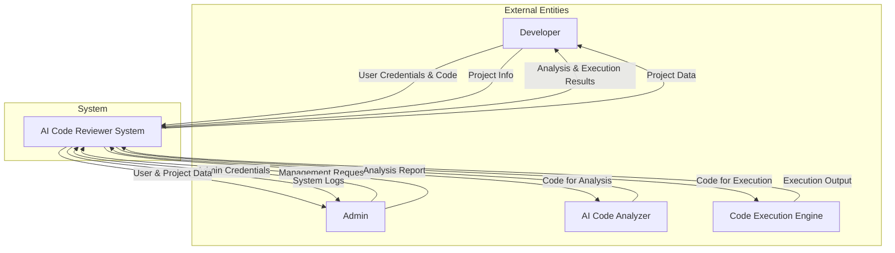

```mermaid
graph TD
    subgraph External Entities
        Developer
        Admin
        AI_Service[AI Code Analyzer]
        Execution_Engine[Code Execution Engine]
    end

    subgraph System
        A[AI Code Reviewer System]
    end

    Developer -- User Credentials & Code --> A
    Developer -- Project Info --> A
    A -- Analysis & Execution Results --> Developer
    A -- Project Data --> Developer

    Admin -- Admin Credentials --> A
    Admin -- Management Requests --> A
    A -- User & Project Data --> Admin
    A -- System Logs --> Admin

    A -- Code for Analysis --> AI_Service
    AI_Service -- Analysis Report --> A

    A -- Code for Execution --> Execution_Engine
    Execution_Engine -- Execution Output --> A
```
